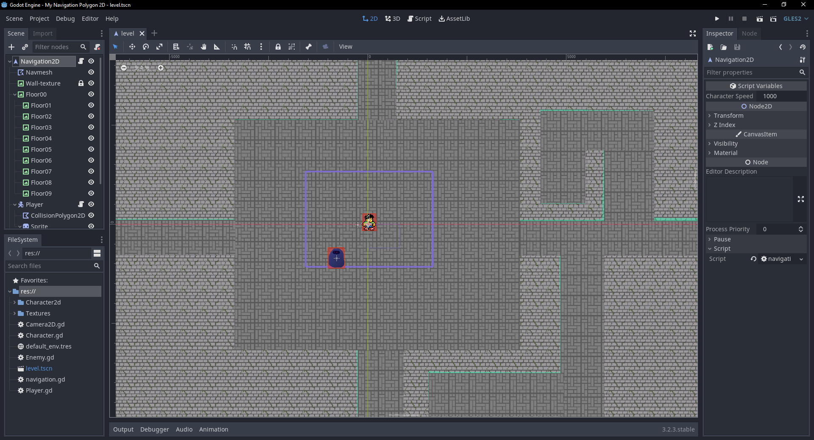

# Navigation Polygon 2D

Default description:
Example of using 2D navigation using a
[`NavigationPolygon`](https://docs.godotengine.org/en/latest/classes/class_navigationpolygon.html)
in a [`NavigationPolygonInstance`](https://docs.godotengine.org/en/latest/classes/class_navigationpolygoninstance.html) node.
It uses the 2D navigation API to request a path between two points,
and then traverses the resulting path.

I added custom sprites and animations to the main character, and created a navmesh to fit two homemade textures: floor, where you can walk, and walls, where you obviously cannot.

Language: GDScript

Renderer: GLES 2

## Screenshots

